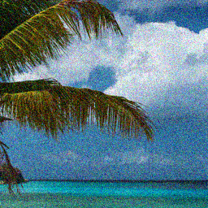
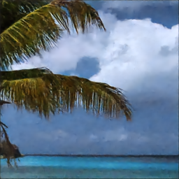
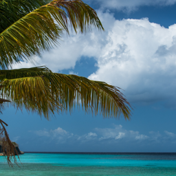

# 
 Image Denoising

## 📸 Sample Results

| Noisy Image | Denoised Output | Ground Truth |
|-------------|------------------|---------------|
|  |  |  |

## Results
|    Loss   |  PSNR | SSIM |
|-----------|-------|------|
| MSE (L2)  | 24.50 | 0.81 |
| MAE (L1)  | 26.72 | 0.83 |
| SSIM      | 25.93 | 0.86 |
| SSIM + L2 | 26.49 | 0.86 |
| SSIM + L1 | 27.71 | 0.83 |

## 🎯 Training and Testing 

All the training and testing commands can be found in `run_experiments.sh`

## 📈 Evaluation Metrics

During testing, we compute:
- **PSNR** (Peak Signal-to-Noise Ratio)
- **SSIM** (Structural Similarity Index)
