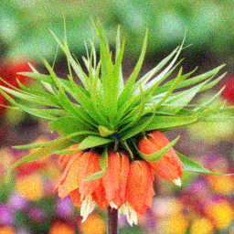
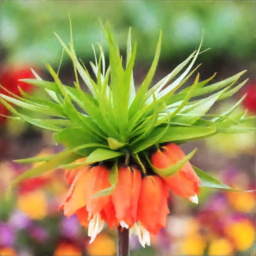
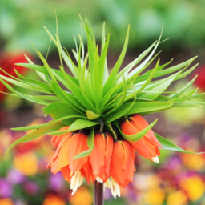

# <p align="center"> Image Denoising</p>


## 📸 Sample Results

| Noisy Image | Denoised Output | Ground Truth |
|-------------|------------------|---------------|
|  |  |  |

## Results
|    Loss   |  PSNR | SSIM |
|-----------|-------|------|
| MSE (L2)  | 24.66 | 0.82 |
| MAE (L1)  | 27.24 | 0.85 |
| SSIM      | 26.23 | 0.88 |
| SSIM + L2 | 26.91 | 0.88 |
| SSIM + L1 | 28.36 | 0.88 |

## 🚀 Installation

   
1. Create a conda environment using Python 3.9.

~~~
conda create -n u2net python=3.9
conda activate u2net
~~~
    
2. Install Pytorch from [Pytorch](https://pytorch.org/get-started/locally/).
   
3. Clone this repo

```bash
git clone https://github.com/PrasannaPulakurthi/U2Net-Image-Denoising.git
cd U2Net-Image-Denoising
pip install -r requirements.txt
```


## 📥 Dataset Preparation

1. Download the train and test DIV2K dataset from [GoogleDrive](https://drive.google.com/drive/folders/1axZDefThLL6y0q1yjVMEkb4LIFfYVj85?usp=sharing).
2. Organize as:

```
data/
└── DIV2K_512/
    ├── Train/
    └── Test/
```

## 🎯 Training and Testing 

All the training and testing commands can be found in `run_experiments.sh`

### Testing

Download the pretrained model `u2net_last.pth` from GoogleDrive to `outputs/exp_5/checkpoints/` and run the following command:

```bash
python test_denoising.py --exp_name exp_5
```

### Training

To train the u2net with L1 and SSIM losses using the following command:

```bash
python train_denoising.py --exp_name exp_5 --loss_type ssim_l1
```

## 📈 Evaluation Metrics

During testing, we compute:
- **PSNR** (Peak Signal-to-Noise Ratio)
- **SSIM** (Structural Similarity Index)
